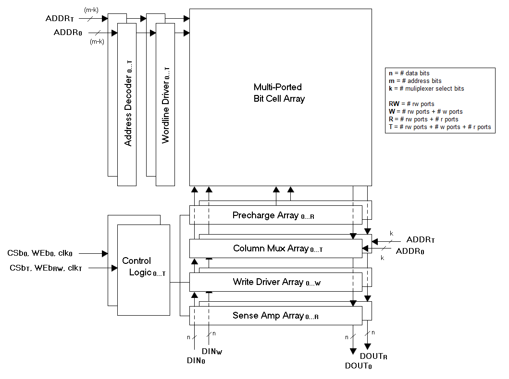
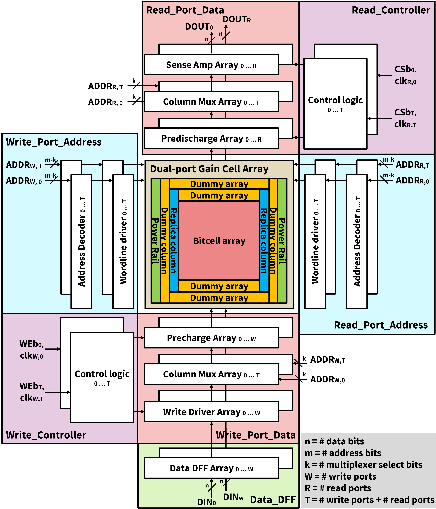

### [Go Back](./index.md#table-of-contents)

# Architecture
This page of the documentation explains the architecture of OpenGCRAM.

## Table of Contents
<!-- 1. [SRAM Architecture](#sram-architecture)
2. [ROM Architecture](#rom-architecture) -->
1. [GCRAM Architecture](#gcram-architecture)

<!-- ## SRAM Architecture
* Bit-cell Array
    * Multiport Bitcells
* Each port:
    * Address Decoder(s)
    * Wordline Driver(s)
    * Column Multiplexer(s)
    * Bitline Precharge(s)
    * Sense Amplifier(s)
    * Write Driver(s)
    * Control Logic with Replica Bitline

## ROM Architecture
* Bit-cell Array
    * 1T NAND Bitcell
* Row Address Decoder
* Wordline Driver(s)
* Column Multiplexer
* Column Pre-Decoder
* Bitline Precharge(s)
* Control Logic -->

## GCRAM Architecture
* Gain-cell Array
    * Dual-port gain-cells
* Read port:
    * Read_Port_Address Module drive RWLs
        * Address Decoder(s)
        * Wordline Driver(s)
    * Read_Port_Data Module read out RBL
        * Bitline Predischarge(s)
        * Column Multiplexer(s)
        * Sense Amplifier(s)
    * Control Logic with Replica Bitline
* Write Port:
    * Write_Port_Address Module drive WWLs
        * Address Decoder(s)
        * Wordline Driver(s)
    * Write_Port_Data Module drives WBL
        * Column Multiplexer(s)
        * Bitline Precharge(s)
        * Data DFF(s)
        * Write Driver(s)
    * Control Logic with Replica Bitline

    
