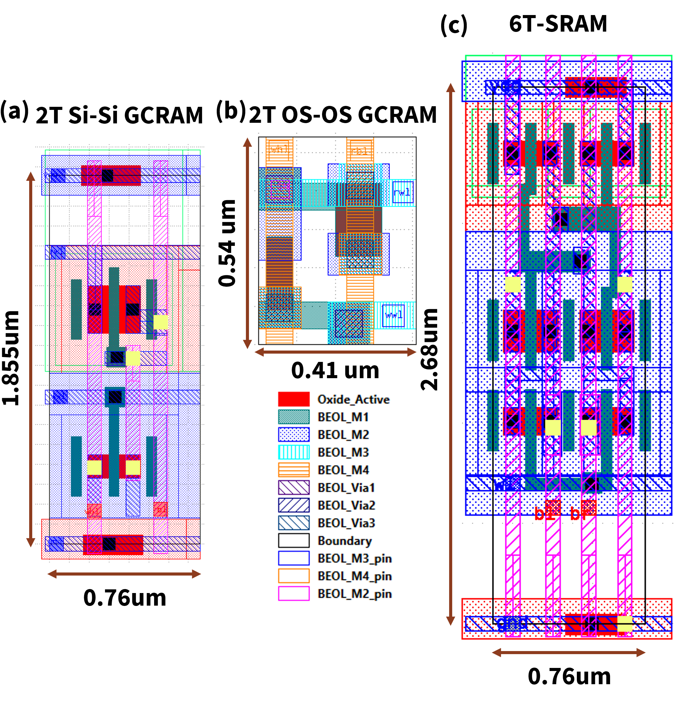

### [Go Back](./index.md#table-of-contents)

# Bitcells
On top of the 6T SRAM bitcells supported by OpenRAM, this page explains the GCRAMs supported by OpenGCRAM.

<!-- ## Table of Contents
1. [6T-SRAM](#6T-SRAM)
1. [Relative Bitcell Sizes](#relative-bitcell-sizes-035um-scmos)
1. [Thin SRAM Bitcells](#thin-sram-bitcells-130nm) -->

## Schematics

* GCRAM 
    * Decoupled read and write paths (WWL, WBL, RWL, RBL)
    * One bitline per port
    * 2T Si-Si (silicon transistors)
    * 2T OS-OS GCRAM (Oxide transistors)

## Layout with Bitcell Sizes

